# IngameIME-Common

Common interface of IngameIME

## Bindings
Use [SWIG](https://github.com/swig/swig) to generate binding files
Currently supported bindings:
- Java
- CSharp
- Python
## Class Diagram
