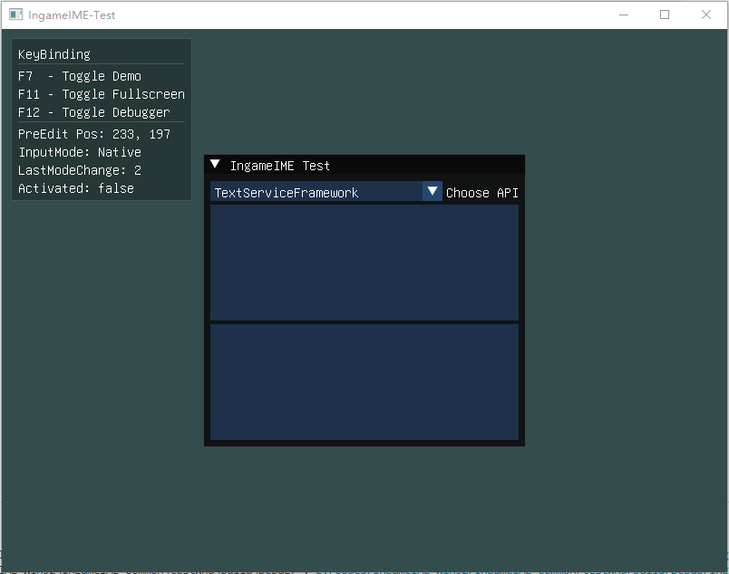

# IngameIME-Common

Common interface of IngameIME

## How to use

Example: <https://github.com/Windmill-City/IngameIME-Common/blob/main/testWnd/src/IngameIMEImpl.cpp>



### Initialize

#### Win32

```c++
// IngameIME: Initialize
HWND hWnd;
// TextServiceFramework for Windows 8 or above
MainContext::Main.InputCtx = IngameIME::CreateInputContextWin32(hWnd, IngameIME::API::TextServiceFramework);
// Imm32 for Windows XP/Vista/7
MainContext::Main.InputCtx = IngameIME::CreateInputContextWin32(hWnd, IngameIME::API::Imm32);
```

### PreEdit & CandidateList

This library is designed for fullscreen games, so you are responsible for rendering: `PreEdit`, `CandidateList` and `Input Mode Indicator`

```c++
/**
 * @brief Receive PreEdit information and render it over the TextEdit
 *
 */
inputCtx->IngameIME::PreEditCallbackHolder::setCallback(
    [](const IngameIME::CompositionState state, const IngameIME::PreEditContext* ctx)
    {
        //Render your preedit
    });

/**
 * @brief Receive the CandidateList and draw it over the TextEdit
 *
 */
inputCtx->IngameIME::CandidateListCallbackHolder::setCallback(
    [](const IngameIME::CandidateListState state, const IngameIME::CandidateListContext* ctx)
    {
        //render your candidate list
    });

/**
 * @brief Receive the converted text and insert it into the TextEdit
 *
 */
inputCtx->IngameIME::CommitCallbackHolder::setCallback([](std::string commit)
    {
        // Insert commit into your text edit
    });

/**
 * @brief Receive the input mode change event, and show an indicator over the TextEdit
 *
 */
inputCtx->IngameIME::InputModeCallbackHolder::setCallback(
    [](IngameIME::InputMode mode)
    {
        //render your input mode indicator
    });
```

### Activate Input Method

```c++
MainContext::Main.InputCtx->setActivated(true/false);
```

## Bindings

Use [SWIG](https://github.com/swig/swig) to generate binding files

Currently supported bindings:

- Java
- CSharp
- Python
